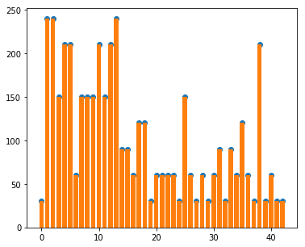
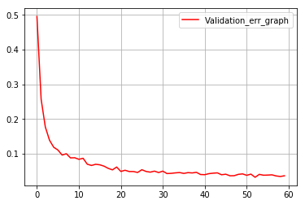

#**Traffic Sign Recognition** 

##Project report

---

**Build a Traffic Sign Recognition Project**

The goals / steps of this project are the following:
* Load the data set (see below for links to the project data set)
* Explore, summarize and visualize the data set
* Design, train and test a model architecture
* Use the model to make predictions on new images
* Analyze the softmax probabilities of the new images
* Summarize the results with a written report

###Load and Explore data
The dataset provided has 34799 training examples,4410 validation examples and 12630 testing examples.The dataset is classified into 43 labels for different types of traffic signs. All the images in the dataset are colored and 32x32 pixels.An image is selected at random and plotted as shown below:

Here is the bargraph of training set data for each label:

Here is the bar graph of validation set data for each label:

The images in each data set (train,valid and test) are grayscaled and normalized. opeccv function cvtColor function ised to conver color images to grayscale.
Normalization and scaling is done as it helps in optimization. The model is tested with both colored as well as grayscaled images, colored images doesn't show superior accuracy, so gray scaled images were chosen with final model.Lecun's paper also used grayscaled images. Here left image is colored and right is grayscaled.

The image below is normalized, left is grayscaled image and right is normalized.

Looking at the training set bar graph, some classes has over 2000 images while some has as low as 180 images. After few trials, I decided to generate "fake" images and augment to classes that has less than 800 images. Essentially, I generated transformed images of existing images using opencv library functions such as GaussianBlur and warpAffine and warpTransform. the transforms are blur,random translate upto 2 pixels,rotate,perspective and warpaffine and perspective.The goal was to get upto minimum of 800 images per class.
Here are transformations added to one of the images (the first image is original image):

Here is the bar graph of training set after augmenting:

###Final Model
The model is based on digit recognition project done earlier in course. Both colored (3 channel) and grayscaled (1 channel) images are tested. 

The architecture mentioned in Lecun,Sermanet. 

My final model consisted of the 2 convolution layer followed by 23 fully connected layers, fully connected layers have dropout for regularization. Here are the details:
**
----------------------------------------------------------------|
| Layer             |     Description	                        | 
|:-------------------------------------------------------------:|    
| Input             | 32x32x1 Grayscale image                   |  
| Convolution 5x5   | 1x1 stride, same padding, outputs 28x28x6 |
| RELU		    |             			        |
| Max pooling	    | 1x1 stride,  outputs 14x14x6 		|
| Convolution 5x5   | 1x1 stride, valid padding,outputs 10x10x16|  
| RELU              |                                           |
| Max pooling       | 1x1 stride, valid padding,outputs 5x5x16  |
| Fully connected   | input 400x 200        			|
| RELU              |                                           |
| Fully connected   | input 200x 100        			|
| RELU              |                                           |
| Fully connected   | input 100x 43        			|
----------------------------------------------------------------|

**

### Training and Tuning
The model is trained initially with color images, however, after trying grayscaled images the accuracy reached is similar with both approaches, so grayscaled images are used for final model training.
The initial epoch number was 10,batch size as 128 and learning rate as 0.001.

The initial training accuracy was aroung 87%,however, I realized using normal random distribution for weight initialization was not a good idea as weights may be too small and model might stop training and gradient might be too small. The weights are then initialized with truncated normal distribution.
Adamoptimizer is used.

After truncated normal weights initialization and using grayscale and normalized image, the validation accuray reached was 92%.
Increasing batch size didn't improve accuracy.
The next step was to implement a piece of code to monitor accuracy during training and validation for each training cycle.
The training accuracy curve was quite steep and then settled to around 97% and so was validation curve. I reduced learning rate to 0.0005 and added dropout threshold of 0.7. The validation accuracy reached over 94%. The dropout for validation and test set was kept at 1.0.
Epoch was gradually increased to 60 and dataset with augmented images was used, cells in fully connected layer was increased as well. 

The validation acuracy reached around 95% with above. Few more experiments with dropout and finally validation accuracy reached was *95.4%* and test set accuracy of *94.2%*.
**Final validation accuracy 95.4% **

**Final test accuracy 94.2% **

Here is the image of train accuracy over different epochs:

and validation accuracy:

###Test a Model on New Images

8 images of German traffic signs  were downloaded from web.Some were clear while others were slightly blurred or tilted at different angles.The images are:

The images were resized to be 32x32 and grayscaled and normalized.

The 30 kmph speed limit image has 2 signs on it while slipper road image is tilted, so might be difficult to identify.

The accuracy reached for these new images was 50%. For 2 of the images the softmax didn't have the correct label in top 5 probabilities.

Here are the results of the prediction:
**

--------------------------------------------------
| Image		     |     Prediction	         | 
|:----------------------------------------------:| 
| Yield		     | Yield       		 | 
| Curveleft	     | Go straight or left	 |
| Priority	     | Priority		         |
| Road work	     | Road work 		 |
| 50kmph	     | Right of way              |
| 30kmph             | Slippery road             |
| Right of way       | Right of way              |
| Slippery road      | Keep right                |
--------------------------------------------------
**

I am a bit surprised with 50kmph not being recognized correctly.
Looking at features identified in each layer would be useful,unfortunately the code given in optional section didn't work as I couldn't figure which variable names to use for tf_variable argument in function!!

Here is softmax top 5 probability for each image 

 

## Further invetigation is required to improve accuracy on the model
Lecun's paper reached >99% accuracy. 

Project html based on ipynb is:

(HTML_REPORT)](https://github.com/atul799/CarND-Traffic-Sign-Classifier-Project/blob/master/Traffic_Sign_Classifier.html)

[//]: # (Image References)
![alt text][image2]

 

### (Optional) Visualizing the Neural Network (See Step 4 of the Ipython notebook for more details)
####1. Discuss the visual output of your trained network's feature maps. What characteristics did the neural network use to make classifications?

